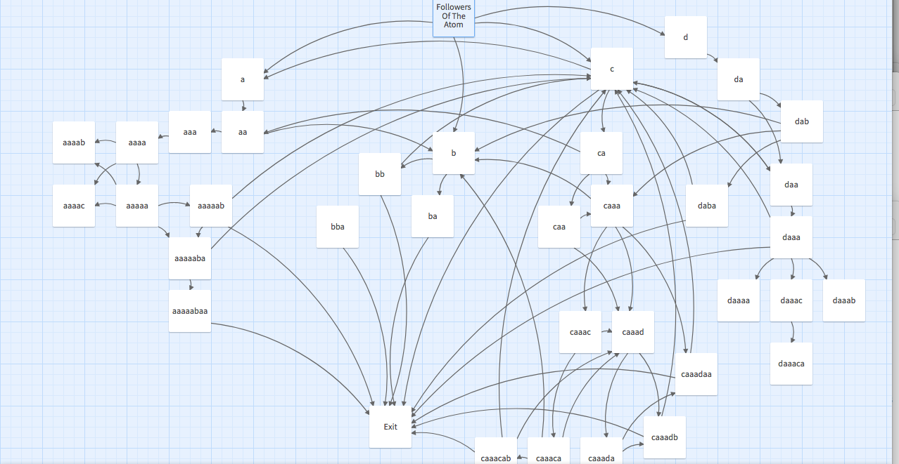
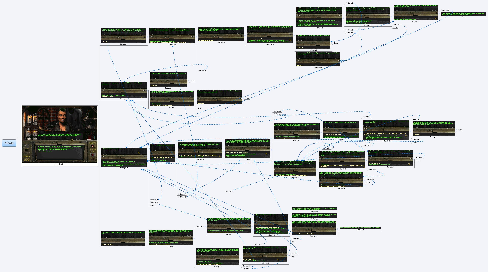

# Nicole's Dialogue

This is an interactive fiction, mostly in HTML and CSS, made with <a href="https://twinery.org">Twine</a>. Click [here](https://l3gomancer.github.io/FalloutOneFollowersNicoleTwineStory/FO%20Nicole.html) to play.

It is inspired by dialogue with Nicole, the leader of a cult of librarians, [the Followers of the Apocalypse](https://fallout.fandom.com/wiki/Followers_of_the_Apocalypse), in the first Fallout game.

Twine helped to plan the paths through the dialogue tree:

A screenshot from the original game:

In the past I tried to plan the dialogue tree in a mind mapping tool with screenshots:

